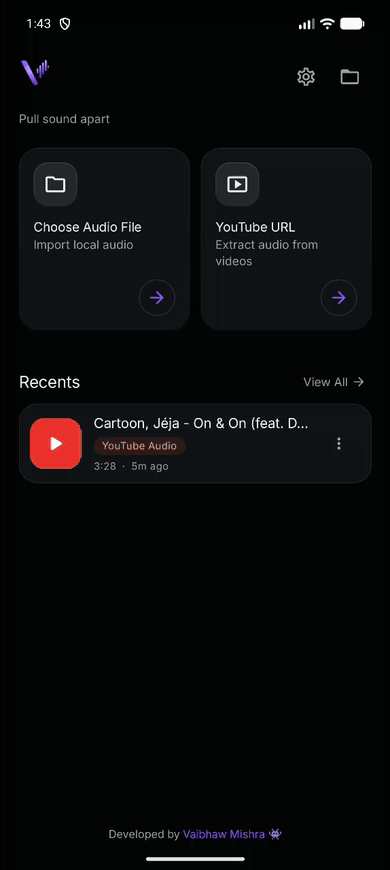
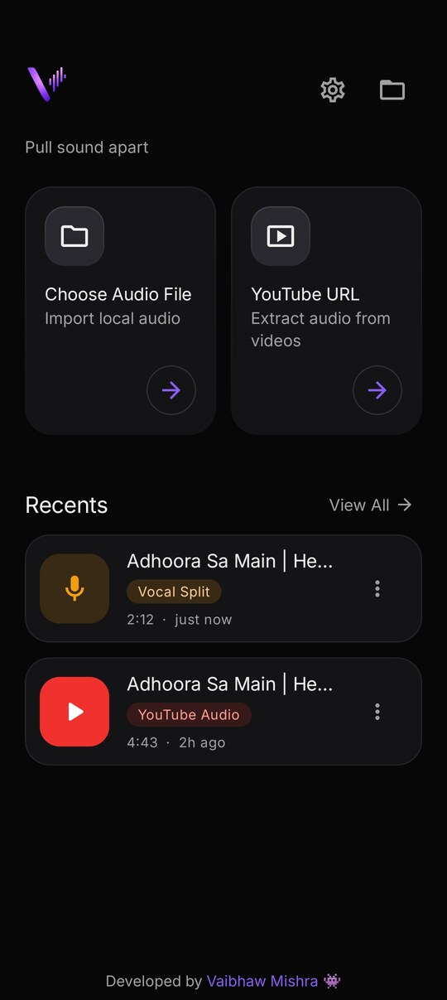
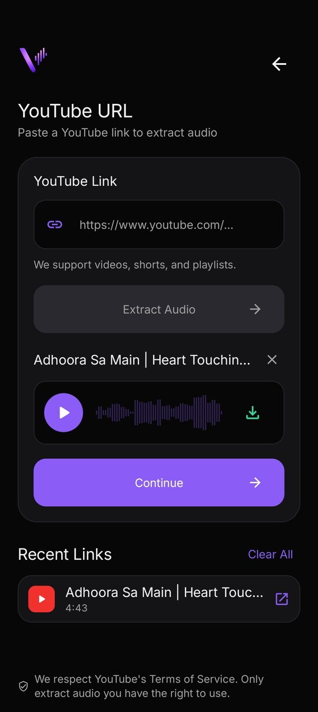
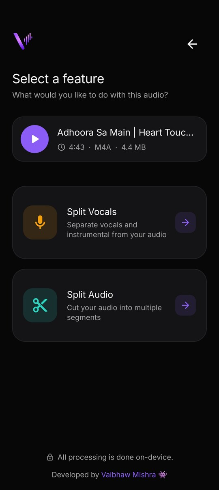
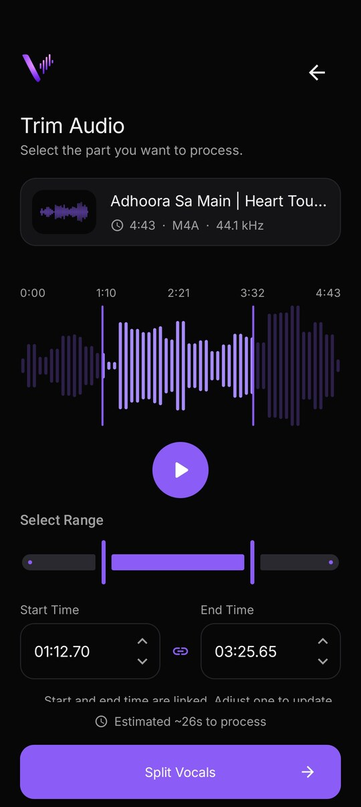
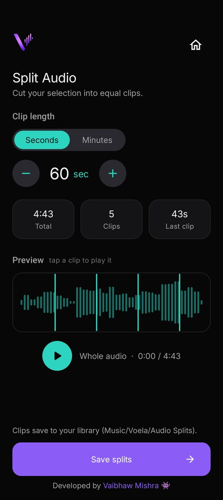
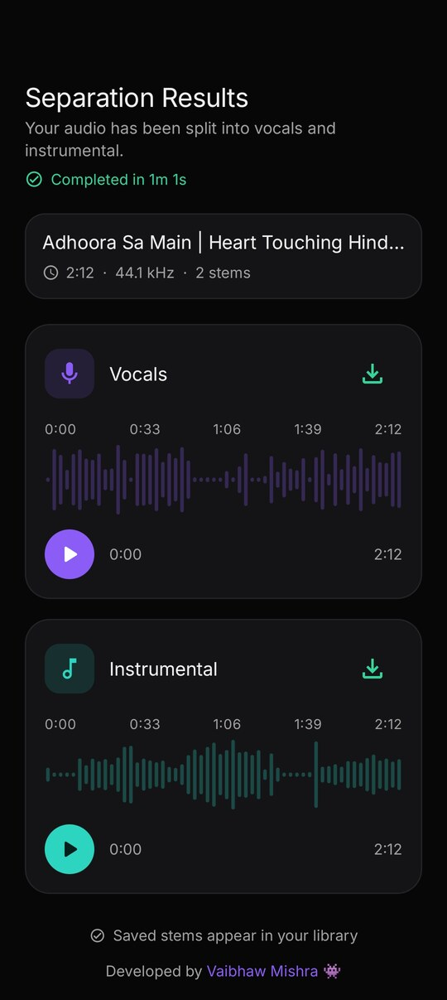

# Voela

### Pull sound apart.

Voela is an on-device Android audio toolkit. Extract audio from YouTube, separate vocals
from the instrumental, and cut audio into clips - all processed **locally on your device**.
No cloud, no uploads, no account, no limits.


## Demo



> [**Watch the full-quality demo (MP4)**](https://github.com/itsvaibhavmishra/Voela/raw/main/docs/assets/voela-demo.mp4)

## Features

- **Split Vocals** - separate any track into **vocals** and **instrumental** on-device, with
  a **Fast** engine for quick results and a **Best** engine (DTTNet) for sharper quality.
- **YouTube extraction** - paste a link and pull the audio out, saved to `Music/Voela/YouTube Downloads`.
- **Split Audio** - cut a track into equal-length clips with live preview.
- **Trim** - select the exact range before processing.
- **Library & Recents** - your extractions and splits are tracked in an app-private library
  with per-item and total size, plus optional auto-clear.
- **Theme** - pick from six dark-mode accent colours (Purple, Blue, Teal, Emerald, Amber, Rose),
  each with contrast-safe text. Dark mode throughout.
- **Output formats** - choose the format and quality for your stems (M4A, MP3, WAV).

## Screens

| Home | YouTube extraction | Choose a feature |
| :---: | :---: | :---: |
|  |  |  |
| **Trim** | **Split Audio** | **Separation results** |
|  |  |  |

## Privacy

Everything happens on your device. Audio is never uploaded, and the app works fully offline
once a track is on your phone. Exported files land in your own **Music/Voela** folder; the
working library is kept app-private.

## Tech

- **Kotlin** + **Jetpack Compose** (Material 3), single-activity, Navigation Compose
- **Media3** ExoPlayer & Transformer for playback and transcoding
- **WorkManager** foreground workers for background processing
- **On-device vocal separation** - native ONNX Runtime with a KissFFT STFT/iSTFT pipeline (JNI/C)
- **Bundled LAME** for MP3 export · **youtubedl-android** for extraction
- `arm64-v8a`, minSdk 26, dark-mode only

## Build

Requirements: JDK 17, Android SDK 36, NDK 28.2.x.

```bash
./gradlew assembleRelease
```

The signed APK is written to `app/build/outputs/apk/release/`. Local builds fall back to the
debug signing key; release builds in CI are signed with a release keystore (see below).

## Releases & versioning

The app version lives in [`version.properties`](version.properties) (`VERSION_NAME` /
`VERSION_CODE`) - the single source of truth, read by Gradle.

- **Cut a release:** bump `version.properties`, open a PR to `main`, and merge. CI builds and
  publishes a GitHub Release tagged `v<VERSION_NAME>` with the APK (it skips if that tag exists).
- **`staging`** acts as a sandbox: every push rebuilds and updates a rolling `staging`
  pre-release, so any pipeline failure surfaces before it reaches `main`.

Download the latest build from the [**Releases**](https://github.com/itsvaibhavmishra/Voela/releases) page.

## License

All rights reserved.
